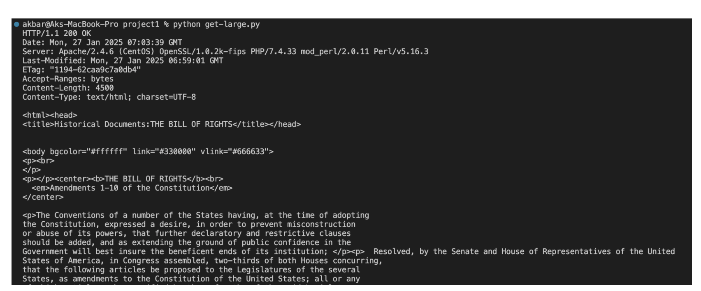

# Introduction: 

For this project, I’m using Python to practice on using sockets to get a file, get data
from a large file, and creating an HTTP server using my knowledge in networks, the textbook,
and resources online.

# How to run:

They are all python3. Download the folder, open it in user’s chosen IDE, and it can be
run with the following commands (assuming user has python 3 installed) in the terminal:

For the “Using a Socket to get a file” program: python connect-socket.py

For “GET the data for a large file” program: python get-large.py

For “The world’s simples HTTP server”: python server.py

# Screenshots:

